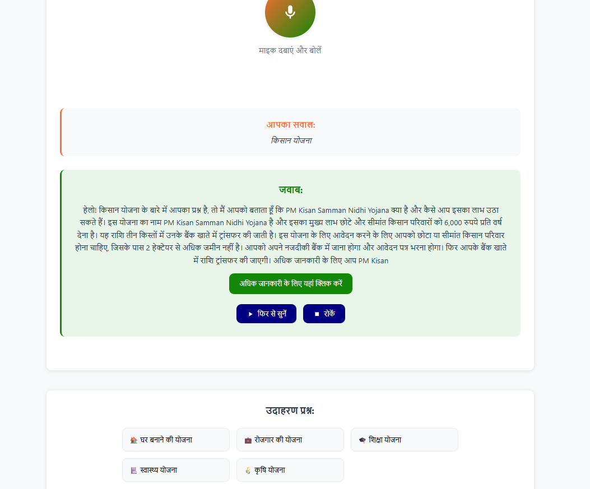

# SwarajyaAI - Voice-Based Government Welfare Assistant

A voice-enabled web application that helps Indian citizens access government welfare schemes in their preferred language, powered by Llama AI for natural Hindi responses.



## 🎯 Features
- **Voice Input**: Web Speech API for voice recognition
- **Natural Hindi Responses**: Llama-powered conversational responses
- **Real Government Schemes**: Curated database of actual schemes
- **Multi-language Support**: Hindi and English
- **Clean Modern UI**: Responsive design for all devices
- **Modular Architecture**: JSON-based schemes database

## 📁 Project Structure
```
SwarajyaAI/
├── frontend/                    # HTML/CSS/JS frontend
│   ├── index.html              # Main UI with voice interface
│   ├── style.css               # Indian-themed styling
│   └── script.js               # Voice recognition & TTS logic
├── backend/                     # FastAPI Python server
│   ├── main.py                 # FastAPI server with JSON integration
│   ├── helper.py               # Groq API & Llama integration
│   ├── schemes_database.json   # Government schemes database
│   ├── manage_schemes.py       # Database management tool
│   ├── test_json_system.py     # Test suite for JSON system
│   ├── setup_groq.py           # Groq API setup script
│   ├── requirements.txt        # Python dependencies
│   └── .env.example            # Environment variables template
└── README.md
└── .gitignore

```

## 🚀 Setup Instructions

### 1. Backend Setup
```bash
cd SwarajyaAI/backend

# Install dependencies
pip install -r requirements.txt

# Configure Groq API key (for Llama integration)
python setup_groq.py

# Test the system
python test_json_system.py

# Start the server
uvicorn main:app --reload --port 8000
```

### 2. Frontend Setup
```bash
cd SwarajyaAI/frontend

# Open in browser (Chrome/Firefox recommended)
# Simply open index.html in your browser
# Allow microphone permissions when prompted
```

### 3. Environment Configuration
Create a `.env` file in the backend directory:
```bash
# Get your API key from https://console.groq.com/keys
GROQ_API_KEY=your-groq-api-key-here
GROQ_MODEL=llama-3.3-70b-versatile
GROQ_TEMPERATURE=0.3
GROQ_MAX_TOKENS=300
```

## 🎤 Usage
1. **Click the microphone button** or press Space
2. **Speak your query** in Hindi or English (e.g., "घर बनाने की योजना")
3. **Listen to the AI response** in natural Hindi
4. **Follow provided links** for detailed information
5. **Use example buttons** for quick testing

## 🗄️ Schemes Database Management

### View Database Statistics
```bash
python manage_schemes.py
# Choose option 7 for statistics
```

### Add New Scheme
```bash
python manage_schemes.py
# Choose option 4 to add new scheme
```

### Search Schemes
```bash
python manage_schemes.py
# Choose option 3 to search
```

### Validate Database
```bash
python manage_schemes.py
# Choose option 6 to validate structure
```

## 🧪 Testing

### Test Complete System
```bash
python test_json_system.py
```

### Test Groq Integration
```bash
python setup_groq.py test
```

### Test API Endpoints
```bash
# Health check
curl http://localhost:8000/

# Search schemes
curl -X POST "http://localhost:8000/search" \
     -H "Content-Type: application/json" \
     -d '{"query": "घर बनाने की योजना"}'

# Legacy query (for frontend)
curl -X POST "http://localhost:8000/query" \
     -H "Content-Type: application/json" \
     -d '{"query": "स्वास्थ्य योजना"}'
```

## 🔧 Key Features

### 🧠 Llama-Enhanced Responses
- **Natural Conversation**: AI generates human-like Hindi responses
- **Context Awareness**: Understands user intent and provides relevant information
- **Simple Language**: Uses everyday Hindi that everyone can understand
- **Comprehensive Answers**: Includes eligibility, application process, and contact info

### 📊 JSON-Based Database
- **Easy Management**: Schemes stored in structured JSON format
- **Version Control**: Track changes and updates
- **Modular Design**: Easy to add/remove/modify schemes
- **Validation**: Built-in validation for data integrity

### 🎯 Smart Search
- **Multi-language**: Searches in both Hindi and English
- **Keyword Matching**: Intelligent relevance scoring
- **Category-based**: Organized by scheme types
- **Fast Results**: Optimized for quick responses

## 📋 Available Scheme Categories
- **🏠 Housing**: PM Awas Yojana, Indira Awas Yojana
- **💼 Employment**: MGNREGA, PM Kaushal Vikas Yojana
- **🎓 Education**: PM Scholarship, Mid Day Meal Scheme
- **🏥 Health**: Ayushman Bharat, Janani Suraksha Yojana
- **🌾 Agriculture**: PM Kisan, PM Fasal Bima Yojana
- **👴 Pension**: PM Shram Yogi Mandhan, NSAP
- **👩 Women**: PM Matru Vandana Yojana, Beti Bachao Beti Padhao

## 🔄 API Endpoints

### GET `/`
Health check and system status

### POST `/search`
Search schemes (returns structured data)
```json
{
  "query": "घर बनाने की योजना"
}
```

### POST `/query`
Legacy endpoint (returns Hindi response for voice)
```json
{
  "query": "स्वास्थ्य योजना"
}
```

### GET `/health/groq`
Check Groq API integration status

### GET `/debug/{query}`
Debug search functionality

## 🛠️ Development Notes

### Adding New Schemes
1. Edit `schemes_database.json` directly, or
2. Use `python manage_schemes.py` for interactive management
3. Restart the server to load changes

### Modifying Responses
- Edit prompts in `helper.py`
- Adjust Llama model parameters in `.env`
- Test changes with `python setup_groq.py test`

### Frontend Customization
- Modify `style.css` for UI changes
- Update `script.js` for functionality changes
- Add new example queries in `index.html`

## 🎉 Benefits
- ✅ **Always Current**: Easy to update with new schemes
- ✅ **Natural Responses**: Llama generates conversational Hindi
- ✅ **Reliable**: JSON database ensures consistent results
- ✅ **Maintainable**: Modular architecture for easy updates
- ✅ **Scalable**: Can handle thousands of schemes efficiently
- ✅ **User-Friendly**: Voice interface with simple interactions

## 🚨 Troubleshooting

### Common Issues

#### "Server से जवाब नहीं मिला" Error
```bash
# Check if Groq API key is configured
python setup_groq.py

# Test the JSON system
python test_json_system.py

# Verify server is running
curl http://localhost:8000/
```

#### Microphone Not Working
- Ensure you're using Chrome or Firefox
- Allow microphone permissions when prompted
- Check if microphone is working in other applications
- Try refreshing the page and allowing permissions again

#### No Search Results
```bash
# Check database integrity
python manage_schemes.py
# Choose option 6 to validate database

# Test search functionality
python test_json_system.py
```

#### Groq API Issues
```bash
# Test Groq connection
python setup_groq.py test

# Check API key in .env file
cat .env | grep GROQ_API_KEY
```

## 📊 System Architecture

### Data Flow
```
User Voice Input → Web Speech API → Frontend JavaScript → 
FastAPI Backend → JSON Database Search → Groq/Llama Processing → 
Hindi Response → Text-to-Speech → User Audio Output
```

### Components
- **Frontend**: Vanilla JavaScript with Web Speech API
- **Backend**: FastAPI with Pydantic models
- **Database**: JSON file with structured scheme data
- **AI**: Groq API with Llama 3.3 70B model
- **Search**: Keyword-based relevance scoring
- **Voice**: Browser's built-in TTS and STT

## 🔧 Configuration Options

### Environment Variables
```bash
# Required
GROQ_API_KEY=your-api-key-here

# Optional (with defaults)
GROQ_MODEL=llama-3.3-70b-versatile
GROQ_TEMPERATURE=0.3
GROQ_MAX_TOKENS=300
LOG_LEVEL=INFO
```

### Search Configuration
Edit `SEARCH_CONFIG` in `main.py`:
```python
SEARCH_CONFIG = {
    "max_results": 10,        # Maximum search results
    "min_query_length": 2     # Minimum query length
}
```

## 📈 Performance Metrics

### Response Times
- **JSON Database Load**: ~50ms
- **Search Query**: ~10-20ms
- **Groq API Call**: ~1-3 seconds
- **Total Response**: ~1-4 seconds

### Database Stats
- **Total Categories**: 7
- **Total Schemes**: 14+
- **File Size**: ~15KB
- **Load Time**: <100ms

## 🔐 Security Considerations

### API Key Protection
- Store Groq API key in `.env` file
- Never commit `.env` to version control
- Use environment variables in production
- Rotate API keys regularly

### CORS Configuration
```python
# In production, replace "*" with your domain
allow_origins=["https://yourdomain.com"]
```

### Input Validation
- All user inputs are validated
- SQL injection not applicable (JSON database)
- XSS protection through proper encoding

## 🚀 Deployment

### Local Development
```bash
# Backend
cd backend
uvicorn main:app --reload --port 8000

# Frontend
cd frontend
python -m http.server 3000
# Or simply open index.html in browser
```

### Production Deployment
```bash
# Backend with Gunicorn
pip install gunicorn
gunicorn main:app -w 4 -k uvicorn.workers.UvicornWorker --bind 0.0.0.0:8000

# Frontend with Nginx
# Serve static files through web server
```

### Docker Deployment
```dockerfile
# Example Dockerfile for backend
FROM python:3.9-slim
WORKDIR /app
COPY requirements.txt .
RUN pip install -r requirements.txt
COPY . .
CMD ["uvicorn", "main:app", "--host", "0.0.0.0", "--port", "8000"]
```

## 📝 Changelog

### Version 1.0 (Current)
- ✅ JSON-based schemes database
- ✅ Groq/Llama integration for Hindi responses
- ✅ Voice interface with Web Speech API
- ✅ Database management tools
- ✅ Comprehensive testing suite
- ✅ Multi-language support (Hindi/English)
- ✅ Responsive UI design

### Planned Features
- 🔄 Real-time scheme updates from government APIs
- 🔄 User authentication and personalization
- 🔄 Multi-state scheme support
- 🔄 Mobile app version
- 🔄 Offline mode support

## 🤝 Contributing

### How to Contribute
1. **Fork the repository**
2. **Create a feature branch**: `git checkout -b feature/new-schemes`
3. **Add new schemes** to `schemes_database.json`
4. **Test your changes**: `python test_json_system.py`
5. **Commit changes**: `git commit -m "Add new education schemes"`
6. **Push to branch**: `git push origin feature/new-schemes`
7. **Submit a pull request**

### Contribution Guidelines
- Follow the existing JSON structure for schemes
- Include all required fields: title, description, link, keywords
- Test thoroughly before submitting
- Update documentation if needed
- Use clear commit messages

### Adding New Schemes
```json
{
  "title": "Scheme Name",
  "description": "Detailed description of the scheme",
  "link": "https://official-website.gov.in",
  "eligibility": "Who can apply",
  "benefits": "What benefits are provided",
  "application_process": "How to apply",
  "documents_required": ["Document 1", "Document 2"],
  "keywords": ["keyword1", "keyword2", "हिंदी_keyword"]
}
```

## 📞 Support

### Getting Help
- **Issues**: Create a GitHub issue for bugs or feature requests
- **Documentation**: Check this README for detailed information
- **Testing**: Use the built-in test suite to diagnose problems

### Community
- Share your experience using SwarajyaAI
- Suggest new government schemes to add
- Report any inaccuracies in scheme information
- Help translate to other Indian languages

---

## 🎉 **SwarajyaAI: Empowering Citizens with AI-Powered Government Scheme Access**

Your voice assistant now provides authentic, up-to-date government scheme information with natural Hindi responses, making government services accessible to every Indian citizen! 🇮🇳

**Made with ❤️ for the people of India**